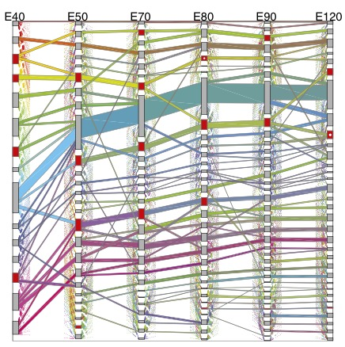
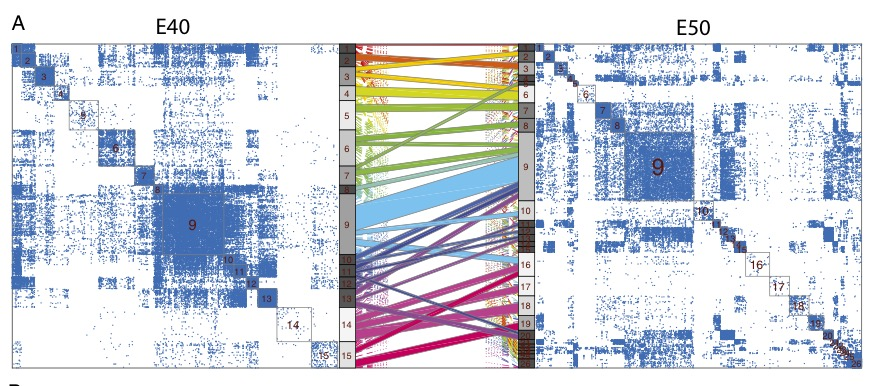
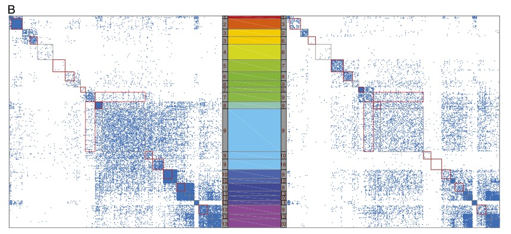

```{r setup, include=FALSE}
options(htmltools.dir.version = FALSE)
```

## Community detection is clustering on networks
--

Networks or graphs are used to display **connections** within a complex system 

--

The **vertices** in a network often reveal clusters with many edges joining vertices of the same cluster

--

Such clusters or **communities** could arise from functionality of distinct components of the network

---

## Most networks need to be modeled dynamically

--

Statistical theory has mostly focused on **static networks** observed as a single snapshot in time 

--

In reality networks are generally **dynamic** in a temporal sense

--

It is of substantial interest to discover the communities within each network model their connectivities

--

Moreover having effective methods of **visualizing changing community structure** is equally important

---
## PisCES : An algorithm for dynamic community detection

--

Paper proposes the **P**ers**is**tent **C**ommunities by **E**igenvector **S**moothing **(PisCES)** algorithm for detecting time-varying community structure 

--

Applied to **changing gene expression** is measured during a broad range of developmental periods in rhesus monkey brains. 

--

The analysis suggests the existence of **change points** as well as periods of persistent community structure

--

Fundamentally the method is driven by extending **spectral graph theory** algorithms with temporal changes

---

### Spectral methods are useful for Static community detection

--

Spectral clustering is a popular class of methods for finding communities in a static network

--

Interactions are represented by a symmetric $n \times n$ adjacency matrix $A$ and a fixed number of communities $K$

--

Method computes the degree-normalized (or “Laplacianized”) adjacency matrix $L$

$$L = D^{-1/2}AD^{-1/2} \quad \text { where } \quad D = \operatorname{diag}(\text{ degree })$$

--

Eigenvectors corresponding to its $K$ largest eigenvalues of $L$ in absolute value are selected

--

Returns the clusters found by K-means clustering on the eigenvectors of $L$ 

---

###   Spectral Methods for Dynamic Networks smooth static networks over time

--
Let $A_1 , \ldots , A_T$ denote a time series of symmetric adjacency matrices for $t = 1, \ldots , T$  

--

let $L_t$ denote the Laplacianized version of $A_t$  and $K$ be fixed

--

Let $V_t \in \mathbb{R}^{n \times K}$ denote the matrix whose columns are the $K$ leading eigenvectors of $L_t$ . Let $U_t = V_t V_t^T$ the projection matrix onto the column space of $V_t$
        
$$\min_{ \overline{U}_{1} , \ldots , \overline{U}_{ T }} \sum_{t=1}^{T} \left\| U_{t} - \overline{U}_{t} \right\|_{F}^{2} + \alpha \sum_{t = 1}^{T - 1} \left\| \overline{U}_{t} - \overline{U}_{t + 1} \right\|_{F}^{ 2 }$$
$$\overline{U}_{t} \in \left\{ W^{T} : V \in \mathbb {R}^{n \times K} , V^{T} V = I \right\} \forall t$$

--

Apply K-means clustering to the eigenvectors of each smoothed matrix $\overline{U}_{1} , \ldots , \overline{U}_{ T }$ separately


---

### Eigenvector smoothing is nonconvex and solved iteratively

.pull-left[

$$\Pi _ { K } ( M ) = \sum _ { k = 1 } ^ { K } v _ { k } v _ { k } ^ { T }$$

$$\overline { U } _ { 1 } ^ { \ell + 1 } = \Pi _ { K } \left( U _ { 1 } + \alpha \overline { U } _ { 2 } ^ { \ell } \right)$$

$$\overline { U } _ { t } ^ { \ell + 1 } = \Pi _ { K } \left( \alpha \overline { U } _ { t - 1 } ^ { \ell } + U _ { t } + \alpha \overline { U } _ { t + 1 } ^ { \ell } \right) \\t = 2 , \ldots , T - 1$$

$$\overline { U } _ { T } ^ { \ell + 1 } = \Pi _ { K } \left( \alpha \overline { U } _ { T - 1 } ^ { \ell } + U _ { T } \right)$$
]

.pull-right[

- Eigenvector smoothing is **non-convex**

- No known efficient methods exist for efficient solution

- The paper proposes this **iterative algorithm** for global solution

- **Convergence result:** For appropriate choice of $\alpha$ the iterative algorithm converges to the global optimum in Eigenvector smoothing
]

---

### Laplacian Smoothing is a variant of eigenvector smoothing

$$\overline { U } _ { 1 } ^ { \ell + 1 } = \Pi _ { K } \left( |L| _ { 1 } + \alpha \overline { U } _ { 2 } ^ { \ell } \right)$$
$$\overline { U } _ { t } ^ { \ell + 1 } = \Pi _ { K } \left( \alpha \overline { U } _ { t - 1 } ^ { \ell } + |L| _ { t } + \alpha \overline { U } _ { t + 1 } ^ { \ell } \right)$$

$$\overline { U } _ { T } ^ { \ell + 1 } = \Pi _ { K } \left( \alpha \overline { U } _ { T - 1 } ^ { \ell } + |L| _ { T } \right)$$

Globally solves the following for specific values of $\alpha$

$$\min_{ \overline{U}_{1} , \ldots , \overline{U}_{ T }} \sum_{t=1}^{T} \left\| |L|_{t} - \overline{U}_{t} \right\|_{F}^{2} + \alpha \sum_{t = 1}^{T - 1} \left\| \overline{U}_{t} - \overline{U}_{t + 1} \right\|_{F}^{ 2 }$$

$$\overline{U}_{t} \in \left\{ W^{T} : V \in \mathbb {R}^{n \times K} , V^{T} V = I \right\} \forall t$$

---


### PiSCES is an extension of Laplacian Smoothing for unknown $K$

--

PisCES extends Laplacian smoothing by allowing the number of classes K to be unknown and possibly varying over time.    

--

Here $\Pi _ { K } ( M ) = \sum _ { k = 1 } ^ { K } v _ { k } v _ { k } ^ { T }$ is replaced by $\Pi( M ) = \sum _ { k = 1 } ^ { \kappa ( M ) } v _ { k } v _ { k } ^ { T }$


--

Here $\kappa : \mathbb { R } ^ { n \times n } \mapsto \mathbb { N }$ is a function that determines the number of eigenvectors to be returned, and $V _ { 1 } , \dots , V _ { \kappa } ( M )$ are the eigenvectors of M corresponding to its $\kappa ( M )$ largest eigenvalues in absolute value.  

--

The map $\kappa ( M )$ is chosen by a method known as **model order selection**, essentially based on ranking the largest eigenvalues until the differences fall below a given threshold

--

The iterates for PisCES are **heuristic** in that no convergence theorems are known

---
# PisCES Application: Rhesus Monkey Genotype

--

The transcriptional patterns of the developing primate brain are of keen interest to neuroscientists

--

Bakken et al. provide a high-resolution transcriptional atlas of rhesus monkeys (Macaca mulatta) built from recorded samples of gene expression

--

Includes expression of 9,173 genes that can be mapped directly to humans

--

The samples span six prenatal ages from 40-120 embryonic days (E40–E120) and four postnatal ages from 0-48 mo

--

For each group of samples coexpression networks are represented by the adjacency matrix $A_t, t \in (E40, \ldots E120)$ which is a soft thresholding the empirical correlation matrix

$$\left[ A _ { t } \right] _ { i j } = \left| \operatorname { corr } \left( g _ { i } , g _ { j } \right) \right| ^ { 6 } , \quad i \neq j$$

---
### Sankey Plots represent the dynamic community structure in PisCES

--

.pull-left[


.caption[**Fig. 1:** Sankey plot for prenatal cases]
]

--

.pull-right[

- Gray and red boxes denote communities, with height indicating community size. 

- Colored “flows” denote groups of genes moving between communities, with height indicating flow size. 

- Each flow’s color is determined by its gene membership and equals the mixture of the colors of its input flows. 
]

---
### We can zoom in on further between 2 separate time points



--

Transition from E40 to E50 and display thresholded weighted adjacency matrices along with the mapping between communities

---
### We can also filter to nodes which have large flows



--

Submatrices of LE40 and LE50 corresponding to those genes in large flows between E40 and E50

---

# Modifications to PisCES may be necessary specfic to applications

--

Weighted adjacency matrices over time may be more suitable where fine spatiotemporal changes can be effectively measured

--

Correlation may not be appropriate to to capture coexpressive dependencies over time

--

Other measures of co-expression may be needed where there is insufficient variability to detect correlation between nodes

--

Creation of adjacency matrices can be adhoc (e.g. thresholding) and sensitivity should be assessed to different variants

---

# PiSCES implementations can be accessed online

--

The PiSCES implementation is coded in `Matlab` and freely available at [https://github.com/letitiaLiu/PisCES]()

--

Contains the code to reproduce various graphs in the report

--

For applications may be important to compress the time dimension
so that Sankey visualization is feasible

---

### Conclusion

--

PiSCES is an extension of Laplacian Smoothing for dynamic community detection

--

PisCES allows the number of communities to be unknown and possibly varying over time

--

Although the algorithm is heuristic (no global guarantees) it is still a useful exploratory tool

--

Care needs to be taken to find the appropriate metric of co-expressivity i.e. adjacency matrices, correlation matrices or some nonlinear dependence between channel pairs

---

# References

Liu, Fuchen, et al. "Global spectral clustering in dynamic networks." *Proceedings of the National Academy of Sciences* (2018): 201718449.

Slides created via the R package [**xaringan**](https://github.com/yihui/xaringan)